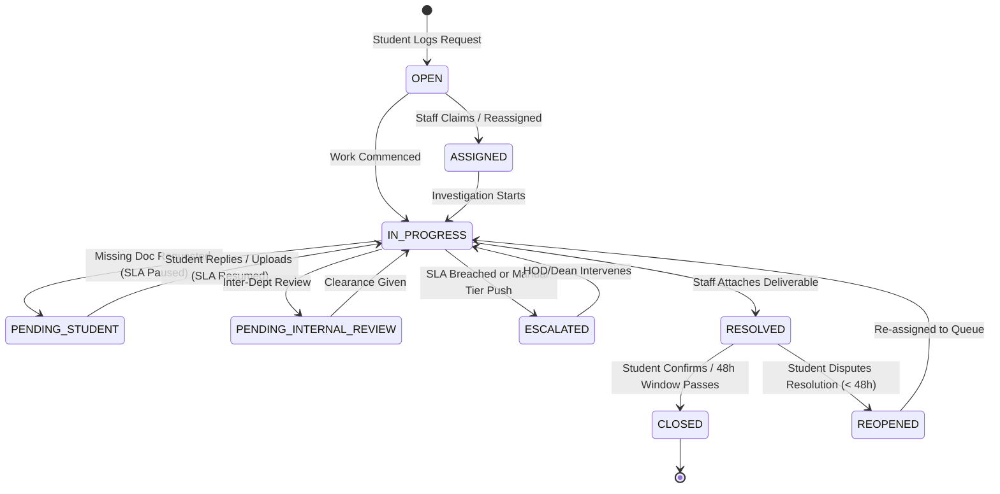

# Approach Note & System Architecture: EduMerge CampusDesk

> **Document Version:** 1.0.0  
> **Author:** Candidate Assessment Submission — Pre-Drive Product Engineering  
> **Problem Statement:** Assignment 4 — Student Support & Ticket Management

---

## 1. Problem Understanding & Product Thinking

### 1.1 The Higher-Education Context
University campuses are complex multi-stakeholder ecosystems. On any given day, thousands of students interact with distinct administrative departments:
- **Accounts & Finance:** Submitting fee challans, seeking installment concessions, and reconciling duplicate UPI deductions.
- **Academic Affairs & Records:** Seeking medical leave adjustments (which directly affect exam eligibility thresholds like the 75% attendance rule).
- **Security & Identity Cell:** Managing lost RFID student ID cards required for hostel biometric turnstiles and exam hall entry.
- **Examinations & Certificates:** Requesting urgent bonafide certificates for passport/visa appointments and official transcripts.

### 1.2 Failure Modes of Legacy Campus Support
In conventional university setups:
1. **Opaque Black Holes:** Students drop physical forms into collection boxes with zero tracking numbers, leaving them anxious about deadlines.
2. **Unfair SLA Penalization:** When staff request a missing doctor’s note, the ticket remains "open," creating artificial SLA breaches on the staff ledger even though the delay is on the student's end.
3. **Information Silos:** Academic records officers cannot communicate internally with the finance desk to verify fee clearance before printing degree certificates without cumbersome email chains.
4. **Lack of Executive Foresight:** Deans only learn of chronic delays when students protest outside administrative blocks, because there is no real-time ageing distribution dashboard.

---

## 2. Product Architecture & Engineering Design

```
+----------------------------------------------------------------------------------------------------+
|                                    EduMerge CampusDesk Platform                                    |
+----------------------------------------------------------------------------------------------------+
                                                  │
            ┌─────────────────────────────────────┼────────────────────────────────────┐
            ▼                                     ▼                                    ▼
┌─────────────────────────┐           ┌────────────────────────┐           ┌────────────────────────┐
│     Student Portal      │           │ Helpdesk Agent Console │           │  Dean Executive Radar  │
│  - Category-smart Form  │           │ - Departmental Queues  │           │ - SLA Compliance Rate  │
│  - Live SLA Clock       │           │ - One-click Self-claim │           │ - Ageing Heatmap (0-7d)│
│  - Two-way messaging    │           │ - Dual-channel notes   │           │ - Escalation Watchlist │
│  - CSAT Rating Modal    │           │ - Canned policy replies│           │ - Audit Report Export  │
└─────────────────────────┘           └────────────────────────┘           └────────────────────────┘
            │                                     │                                    │
            └─────────────────────────────────────┼────────────────────────────────────┘
                                                  ▼
                         ┌──────────────────────────────────────────────────┐
                         │               Core Ticket Engine                 │
                         │ - Finite State Machine (Open -> Closed)          │
                         │ - Real-Time SLA Watchdog & Auto-breach Log       │
                         │ - SLA Pause Engine (Pending Student Action)      │
                         │ - Immutable Activity History Audit Trail         │
                         └──────────────────────────────────────────────────┘
                                                  │
                                                  ▼
                         ┌──────────────────────────────────────────────────┐
                         │         Data & Persistence Layer                 │
                         │ - LocalStorage Session Cache                     │
                         │ - Rehydrate / Seed Reset Service                 │
                         │ - JSON & CSV Data Serializers                    │
                         └──────────────────────────────────────────────────┘
```

---

## 3. Finite State Machine (FSM)

A ticket follows a rigorous lifecycle with deterministic state transitions:



### State Definitions & SLA Impact
| State | SLA Clock Behavior | Trigger / Transition Criteria |
| :--- | :--- | :--- |
| `OPEN` | **Active** | Ticket logged by student; waiting in department unassigned pool. |
| `ASSIGNED` | **Active** | Specific staff officer has accepted ownership. |
| `IN_PROGRESS` | **Active** | Staff actively processing/verifying the request. |
| `PENDING_STUDENT` | **PAUSED ⏸️** | Staff requested missing proof. SLA timer pauses; clock stops ticking. |
| `PENDING_INTERNAL_REVIEW`| **Active** | Awaiting finance audit or registrar sign-off. |
| `ESCALATED` | **Active (Urgent)** | Automatically triggered on breach or manually pushed to HOD/Dean. |
| `RESOLVED` | **Stopped (Frozen)** | Deliverable provided. Awaiting student CSAT or verification. |
| `CLOSED` | **Concluded** | Verified complete. Final immutable state. |
| `REOPENED` | **Resumed** | Student rejected resolution with reason within 48-hour window. |

---

## 4. SLA Engine & Mathematical Formulation

### 4.1 Priority & Commitment Windows
| Priority | First Response SLA | Resolution SLA | Typical Triggers |
| :--- | :--- | :--- | :--- |
| **P1 - Critical** | **2 Hours** | **12 Hours** | Lost ID card on exam day, fee hold blocking course registration cutoff. |
| **P2 - High** | **4 Hours** | **24 Hours** | Medical leave condonation before attendance freeze, hall ticket error. |
| **P3 - Medium** | **8 Hours** | **48 Hours** | Bonafide certificate for passport/visa appointment, duplicate fee receipt. |
| **P4 - Low** | **24 Hours** | **72 Hours** | General inquiry, hostel room maintenance, bus pass renewal. |

### 4.2 The SLA Pause & Resume Algorithm
When a ticket moves to `PENDING_STUDENT`, we capture the pause timestamp:
$$\text{slaPausedAt} = T_{\text{pause}}$$
$$\text{isSlaPaused} = \text{true}$$

While paused, the UI displays a purple badge: **`Clock Paused`**.

When the student replies (or uploads a document), the system resumes the clock:
$$\Delta t_{\text{paused}} = T_{\text{resume}} - T_{\text{pause}}$$
$$\text{resolutionDueAt}_{\text{new}} = \text{resolutionDueAt}_{\text{old}} + \Delta t_{\text{paused}}$$
$$\text{totalPausedMinutes} = \text{totalPausedMinutes} + \left\lfloor \frac{\Delta t_{\text{paused}}}{60000} \right\rfloor$$

This mathematical guarantee ensures staff members are evaluated strictly on their active processing time.

---

## 5. Ageing Distribution Engine

Tickets that remain active are categorized into standardized operational buckets based on elapsed hours since `createdAt`:

$$\text{Ageing Hours} = \left\lfloor \frac{T_{\text{now}} - T_{\text{created}}}{3600000} \right\rfloor$$

1. **`< 24 Hours` (Fresh):** High priority for initial triage and fast first-response.
2. **`1 – 3 Days` (Active Work):** Standard operational window for verification.
3. **`4 – 7 Days` (Lagging Attention):** At risk of becoming chronic backlogs; highlighted to Department HODs.
4. **`> 7 Days` (Critical Stale):** Severe bottleneck; flagged directly on the Dean's Executive Radar for intervention.

---

## 6. Multi-Tier Escalation Matrix

```
[Level 1: Helpdesk Staff] ──(SLA Elapsed > 80% or Disputed)──> [Level 2: Department HOD]
                                                                        │
                                                      (Critical Breach / Multi-Dept Block)
                                                                        ▼
                                                         [Level 3: Dean of Student Affairs]
```

- **Level 1 (Staff Officer):** Operational owner who investigates and acts on the request.
- **Level 2 (Department HOD):** Receives escalated tickets when the case requires policy exemptions (e.g. condoning attendance below 65% with special senate dispensation).
- **Level 3 (Dean of Student Affairs / Registrar):** Executive tier for institutional emergencies, fee refund authorizations, or repeat complaints.

---

## 7. Dual-Channel Communication & Audit Trail

Staff efficiency requires seamless collaboration without exposing internal deliberations to students:
1. **Public Messages:** Displayed on both the student and staff interfaces.
2. **Internal Staff Notes:** Highlighted in amber with a lock icon. Invisible to the student persona; accessible only to Staff, HOD, and Dean roles for inter-agent handovers.
3. **Canned Policy Templates:** Standardized replies for recurring university scenarios (e.g., UTR banking verification, medical certificate registration requirements).
4. **Immutable Audit Trail:** Every status change, self-assignment, escalation, and pause event records the actor's ID, role, timestamp, and details into `activityLogs`.

---

## 8. Architectural Trade-offs & Engineering Decisions

| Decision | Chosen Approach | Alternative Considered | Rationale |
| :--- | :--- | :--- | :--- |
| **Frontend Framework** | React 18 + Vite | Vanilla JS / Multi-page app | Enables instant component reactivity for live ticking SLA badges, side drawers, and interactive role switching. |
| **Styling Strategy** | Custom CSS Design System | Tailwind CSS | Zero build tool overhead; full control over glassmorphism, pulse animations, and color tokens without CSS purge issues. |
| **State Management** | Context API + LocalStorage | Redux Toolkit | Lightweight, zero boilerplate, persists state across browser refreshes with 1-click "Reset Demo Data" option. |
| **Role Simulation** | Global Role Switcher Bar | Multi-user login screen | Eliminates friction for evaluators; lets reviewers test Student, Staff, HOD, and Dean perspectives in under 60 seconds. |
